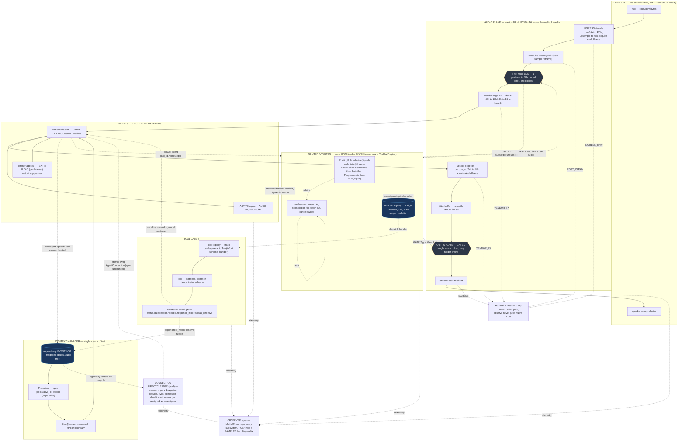
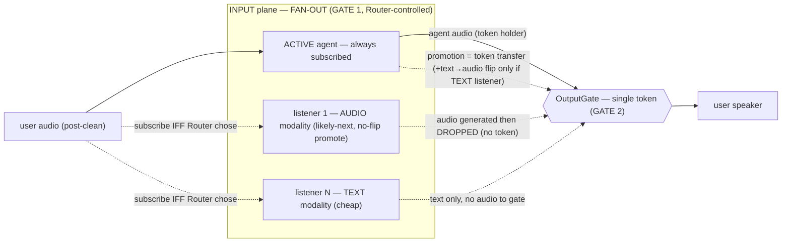
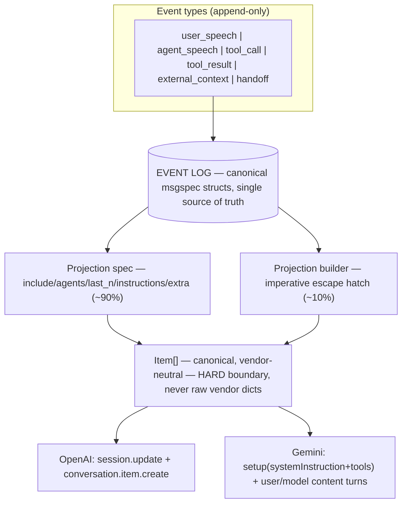
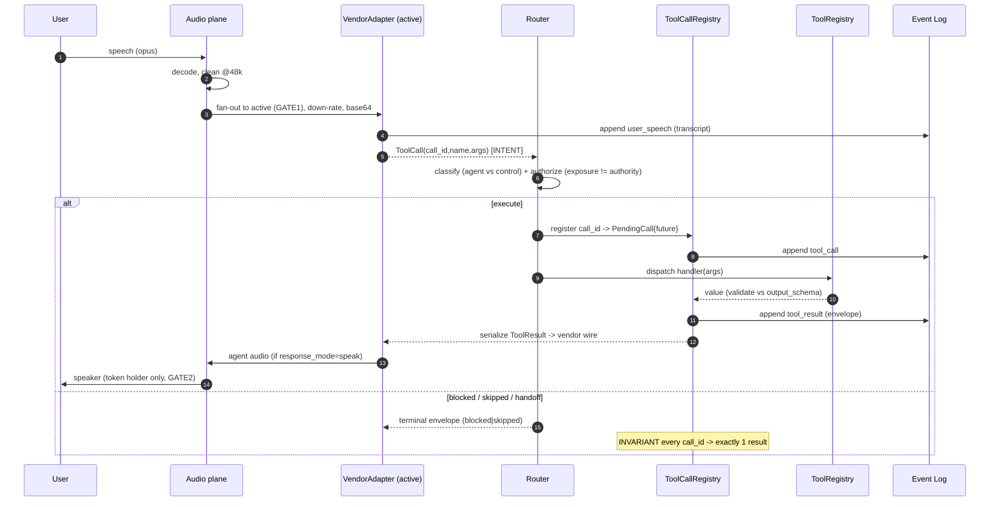
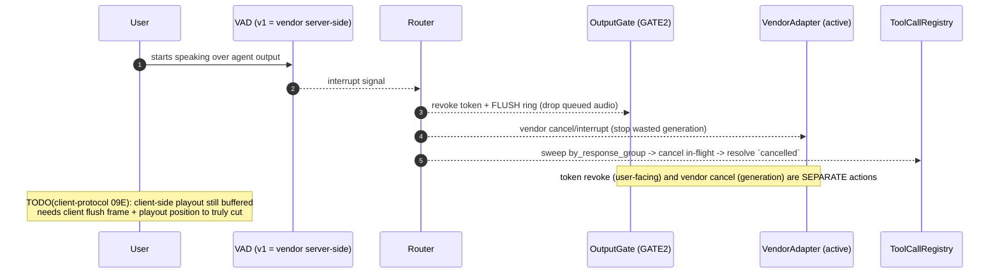
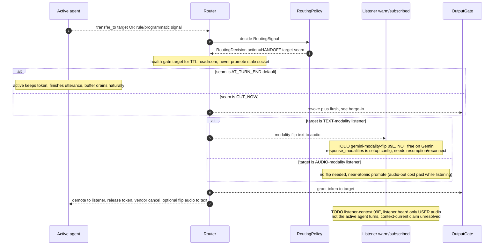
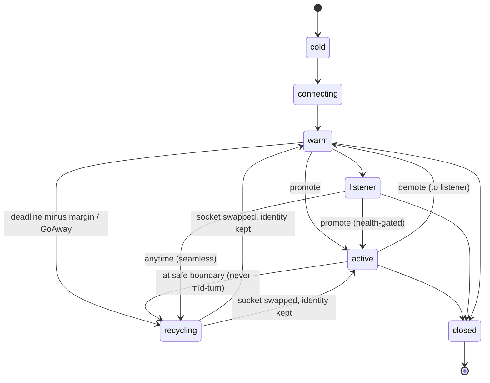
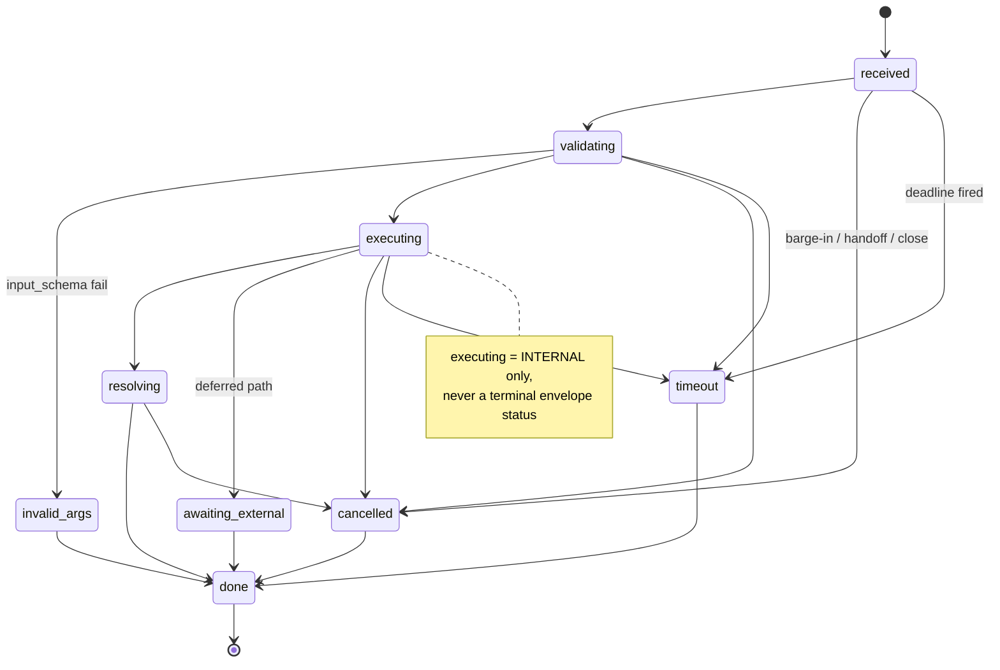
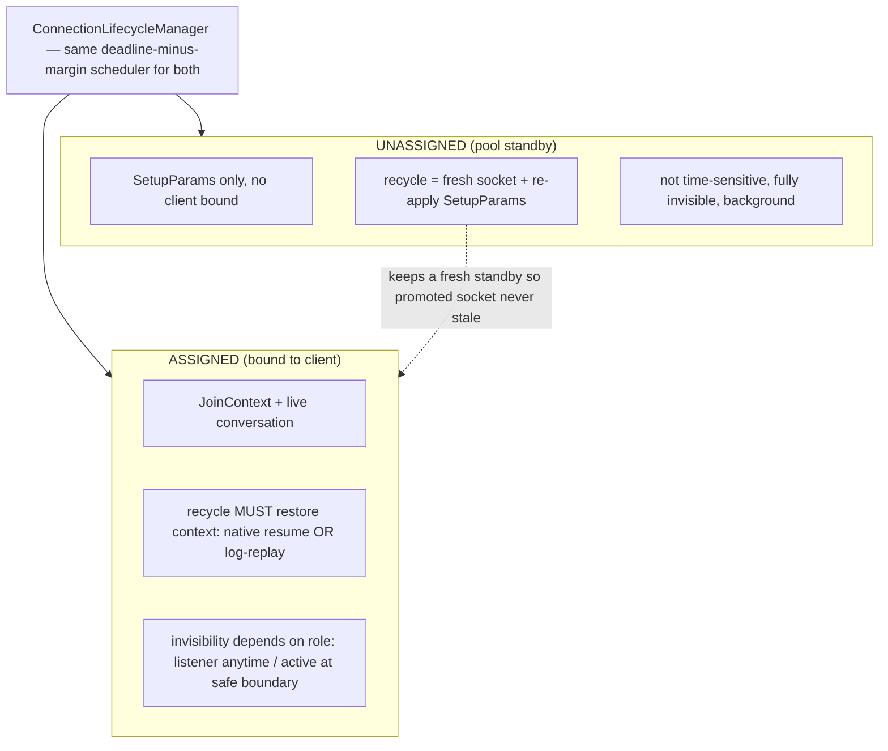

# Mermaid Diagrams (low-level, with control flow)

Machine-renderable companion to the ASCII diagrams in
[08-architecture-diagrams.md](08-architecture-diagrams.md). Everything finalized so
far, one place. Convention across all diagrams:

- **Solid arrows** = **data / audio flow** (bytes, frames, items).
- **Dashed arrows** = **control flow** (decisions, gate ops, token moves, signals).
- Gates are the two control points: **GATE 1** = input subscription (Router-owned),
  **GATE 2** = output token (OutputGate, single writer).

---

## 1. Master system view (data + control)

---

## 2. Two planes — one active + silent listeners

**Invariant:** user hears exactly one stream — single token → overlap structurally
impossible.

---

## 3. Context: log to projection to vendor

---

## 4. Control flow — turn + tool call (intent to result)

---

## 5. Control flow — barge-in (CUT_NOW seam)

---

## 6. Control flow — handoff / promotion (the listener win)

---

## 7. Connection lifecycle (state machine)

**Recycle = kill + rebuild-from-log** (context lives in the log, connections are
disposable). Gemini: native `session_resumption` (fast lane) OR log-replay. OpenAI:
log-replay only.

---

## 8. ToolCall lifecycle FSM (per registry entry)

**Cancel scope by trigger:** barge-in to `by_response_group`; handoff to
`by_connection`; close to everything. First terminal wins (single loop = lockless);
side effects NOT rolled back (handler's job).

---

## 9. Pool — assigned vs unassigned recycle

---

## Notes

- Diagrams reflect **locked** decisions across 01-12. Open items carry inline
  `TODO(...)` notes pointing at [09-pending-items.md](09-pending-items.md) §E
  (design-review TODOs) — chiefly listener-context, gemini-modality-flip,
  client-protocol, and v1-vad, which touch the barge-in/handoff control flow drawn
  above.
- Where a control-flow diagram shows a step that is **not yet free on a vendor**
  (Gemini modality flip, client-side cut), the note is on the arrow so the diagram
  stays honest rather than aspirational.
