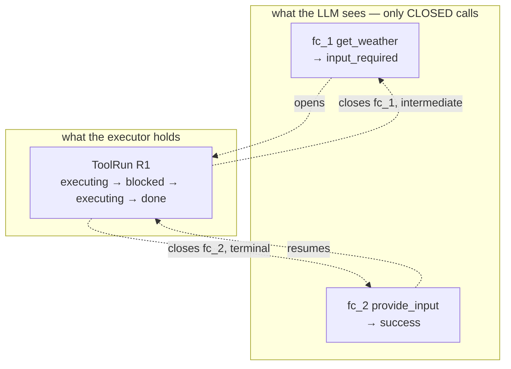
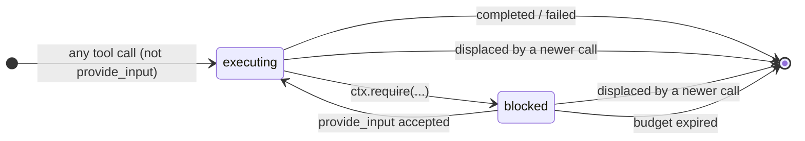

# Multi-step Tool Runs (tools that wait on external input)

Extends **03 (tool layer)** and **04 (tool call registry)**. Neither is amended — this
sits on top of both and preserves their locked rules.

Design history: `scratchpad/tool-call.md` (problem), `scratchpad/tool-call-approaches.md`
(solution space, 6 dimensions × 11 computation models).

## The problem

A tool's execution can depend on something outside the process — user consent, a
confirmation, a chosen option, a value only the user knows. The tool cannot finish until
that arrives.

The vendor makes this awkward: Gemini emits a `tool_call_id` and expects it echoed back
in a `ToolResponse`. **Any** response closes that loop — including one that means "I'm
not done yet."

We do not fight this. We accept that the call closes, and make *call*-terminality and
*run*-terminality two different things.

## Two loops, different terminality

```
PendingCall   = the vendor's loop.    Opened by tool_call_id. MUST close exactly once.
ToolRun       = the executor's loop.  Spans N PendingCalls. Closes when the work is done.
```



`input_required` is **terminal for the call, intermediate for the run.** The LLM treats
it as an answer and moves on. The executor knows better.

**No run identifier ever crosses the LLM boundary.** The key it echoes back is a semantic
name it can re-derive from the conversation it just had — not opaque state it must
safekeep.

## The protocol — one entry, two exits

The whole contract:

```
ENTRY   a tool call arrives
EXIT    exactly one of:
          FINAL          — here is the result
          INPUT_REQUIRED — here is what I need; ask the user, then call provide_input
```

A tool with no external dependency simply never takes the second exit. Its declaration
to the vendor is unchanged. Nothing about authoring it changes.

`provide_input` is **not special to the executor**. It arrives as a tool call and takes
the same two exits. A run that blocks twice produces `input_required` from the first
`provide_input` and is resumed by a second.

## `InputRequired` — the thing a run blocks on

One pending question, with a typed answer.

```python
InputRequired(
    key      = "location_permission",
    expects  = "boolean",                 # boolean | string | number
    ask      = "ask whether you may use their current location …",
    budget_s = 60,
)
```

*Naming: `Ask`, `Need`, and MCP's `Elicitation` were the alternatives.
`InputRequired` was chosen because it matches the status (`input_required`) and the
framework tool (`provide_input`) with no ripple — one word across the whole vocabulary.*

Handlers stay linear:

```python
async def get_weather(args, ctx):
    granted = await ctx.require("location_permission")
    if not granted:
        return ToolResult.blocked("the user declined location access")
    lat, lon = await device_location()
    r = await weather_api(lat, lon, unit=args.get("unit", "C"))
    return {"temp": r.temp, "condition": r.condition}
```

### Declared at setup, or created at runtime — OPEN

Both work. The executor never needs to *look up* what a key means: it created the
`InputRequired` moments earlier and is holding it in the slot, so it already knows the
type and can validate the answer against it.

Declaring on the `Tool` (`requires=(InputRequired(...),)`) buys three things: the
setup-time enum that steers the model toward valid keys, a home for default wording and
budget, and introspection of what a tool might ask for without reading its body. It costs
the ability to ask for something undeclared, and two places to keep in step.

Runtime-only means the handler passes everything at the call site:

```python
granted = await ctx.require(
    "location_permission",
    expects="boolean",
    ask=f"ask whether you may use their location to check the weather in {city}",
)
```

Not settled. See **O4**.

## The `provide_input` declaration

One static declaration, session-wide, `is_framework=True`.

If keys are declared at setup, `key` carries an enum **built by walking the tool
registry**, which bounds the set of possible questions before the session starts. If
requirements are created at runtime, `key` degrades to a plain `STRING` validated
server-side against the slot — the design behaves identically, the model just gets less
steering.

```json
{
  "name": "provide_input",
  "description": "Supply a value that a tool asked for. Only call this after a tool result asked for input.",
  "parameters": {
    "type": "OBJECT",
    "properties": {
      "for_tool":     { "type": "STRING",  "description": "copy exactly from the tool result" },
      "key":          { "type": "STRING",  "enum": ["location_permission"],
                        "description": "copy exactly from the tool result" },
      "bool_value":   { "type": "BOOLEAN" },
      "text_value":   { "type": "STRING"  },
      "number_value": { "type": "NUMBER"  }
    },
    "required": ["for_tool", "key"]
  }
}
```

**The key is the authority on type, not the slot.** The executor resolves `key` against
the blocked run's `InputRequired` and validates the corresponding slot. Wrong slot filled
→ `invalid_args`, retriable, the run stays blocked and still answerable.

Booleans are real booleans. No `"yes"`/`"no"` string parsing anywhere.

`for_tool` is proposed for removal — see **O1**.

## The `input_required` envelope

A new `ToolStatus.INPUT_REQUIRED`. Unlike every other status, its `response` carries
structured fields rather than a flattened string:

```json
{
  "status":   "input_required",
  "for_tool": "get_weather",
  "key":      "location_permission",
  "expects":  "boolean",
  "ask":      "ask whether you may use their current location to check the weather"
}
```

`ask` is where all runtime dynamism lives — it never needs to appear in any schema.
`response_mode: SPEAK`, with the ask as the directive.

## The slots — one run per agent, latest always wins

An agent can only be doing one thing at a time, so the executor holds **one run per
agent**. A newer tool call from that agent displaces whatever it was doing. Multi-agent
sessions run several concurrently; **displacement never crosses agents**.

```
RunSlots: agent_id → ToolRun

ToolRun:
    run_id            # internal only; for log correlation, nothing looks it up
    agent_id          # which agent owns this run
    tool_name
    state             # executing | blocked | done | cancelled
    pending           # the InputRequired, while blocked
    carrier_call_id   # which call receives the next output; None between outputs
```

The agent scoping is also what makes correlation robust: **the connection a call
arrives on names the agent**, and that agent has at most one blocked run. So a submitted
value has exactly one candidate without the model tracking anything.



### Locked rules

1. **Any tool call that is not `provide_input` takes that agent's slot.** Whatever that
   agent had — executing or blocked — is cancelled. Holds uniformly: within a turn,
   across turns, always. Other agents are untouched.
2. **`provide_input` never takes a slot.** It binds to the blocked run of the agent whose
   connection it arrived on. That agent has nothing blocked → `skipped`.
3. **A finished run** closes its carrier call with the result and empties the slot.
4. **A blocked run** closes its carrier call with `input_required` and keeps the slot.
   `carrier_call_id` becomes `None` until the next call arrives.
5. **A cancelled run's carrier call, if still open, is closed with `skipped`.** Gemini is
   waiting on that `tool_call_id`; it must be answered. This upholds 04's one-result
   invariant — nothing is left hanging.
6. **`for_tool` or key mismatch → `skipped`.** The value is discarded; the blocked run is
   left untouched and still answerable. A wrong answer never costs the user the chance to
   give the right one.

`for_tool` is **retained**: it gives the model context for the question it is asking, and
it lets a stale answer be rejected rather than misapplied.

### "Silently" means silent, not invisible

Every rule above that says `skipped` means: **the response is sent** (the model is never
left hanging) with `response_mode: SILENT` and no speak directive. The model is not
prompted to say anything about it.

`ToolResult.skipped()` (`tools/result.py:110`) already produces exactly this. No change.

Note the limit of "silent": `TOOL_RESULT` maps to a real conversation item in
`context/projection.py:44`, so a skipped result still sits in history reading
*"handled elsewhere"*. Silent controls speech, not context.

## Worked example — `get_weather`

### Tool definition

```python
Tool(
    name="get_weather",
    description="Current weather at the user's location.",
    input_schema={
        "type": "OBJECT",
        "properties": {"unit": {"type": "STRING", "enum": ["C", "F"]}},
    },
    output_schema={
        "type": "OBJECT",
        "properties": {"temp": {"type": "NUMBER"}, "condition": {"type": "STRING"}},
        "required": ["temp", "condition"],
    },
    requires=(
        InputRequired(
            key="location_permission",
            expects="boolean",
            ask="ask whether you may use their current location to check the weather",
        ),
    ),
    handler=get_weather,
)
```

### System instruction

Deliberately short — long instructions drift in live models.

```
Some tool results ask for input instead of giving an answer. When a result has
status "input_required":
  1. Ask the user the question in "ask", in your own words and voice.
  2. Wait for their answer.
  3. Call provide_input, copying "key" exactly from that result, and putting the
     user's answer in the slot named by "expects":
       boolean -> bool_value, string -> text_value, number -> number_value.
  4. Never supply a value the user did not actually give. If they refuse, decline,
     or change the subject, do not call provide_input.

Some tool results have status "skipped". Say nothing about them and carry on.
```

Rule 4 is the only guard against the model reporting `true` when the user said no. It is
an instruction, not an enforcement — it reduces the risk, it does not remove it.

### Wire trace

```
user: "what's the weather?"
```

```json
{"toolCall": {"functionCalls": [{"id": "fc_1", "name": "get_weather", "args": {}}]}}
```

Run takes the slot → hits `ctx.require` → `blocked`. Carrier `fc_1` is closed:

```json
{"toolResponse": {"functionResponses": [{
  "id": "fc_1", "name": "get_weather",
  "response": {
    "status": "input_required",
    "key": "location_permission",
    "expects": "boolean",
    "ask": "ask whether you may use their current location to check the weather"
  }
}]}}
```

`fc_1` is closed. Gemini has nothing pending. R1 is still in our slot.

```
model: "Sure — is it alright if I use your location?"
user:  "yeah go ahead"
```

```json
{"toolCall": {"functionCalls": [{
  "id": "fc_2", "name": "provide_input",
  "args": {"key": "location_permission", "bool_value": true}
}]}}
```

Slot blocked, key matches, `bool_value` matches `expects` → resume → finish:

```json
{"toolResponse": {"functionResponses": [{
  "id": "fc_2", "name": "provide_input",
  "response": {"status": "success", "data": {"temp": 31, "condition": "haze"}}
}]}}
```

```
model: "It's 31 degrees and hazy."
```

### Displacement

If the user changes the subject while R1 is blocked:

```json
{"toolCall": {"functionCalls": [{"id": "fc_2", "name": "book_cab", "args": {…}}]}}
```

`book_cab` is not `provide_input` → takes the slot → R1 cancelled. R1's call was already
closed, so nothing dangles. A late `provide_input` as `fc_3` finds the slot holding
`book_cab`, not blocked → `skipped`, silent. The stale answer is discarded.

## Event log

Run transitions are **control events, not conversation.** A new `EventType.TOOL_RUN`
carries the transition in `meta`.

`context/projection.py:50` returns `None` for unrecognised types — *"HANDOFF and any
future control-only events: not conversation context"* — so `TOOL_RUN` is invisible to
the model by construction. This matters: the run state we deliberately kept out of the
LLM must not leak back in through the projection.

| transition | meta |
|---|---|
| `started` | run, tool, call_id |
| `blocked` | run, key, expects, deadline |
| `resumed` | run, key, value |
| `displaced` | run, displaced_by, call_id |
| `completed` | run, status |
| `failed` | run, reason |
| `timed_out` | run, key |
| `input_rejected` | key, why: `no_blocked_run` \| `key_mismatch` \| `type_mismatch` |

Full trace for the worked example:

```
tool_call    fc_1  get_weather
tool_run     started      run=R1 tool=get_weather
tool_run     blocked      run=R1 key=location_permission expects=boolean
tool_result  fc_1  input_required
tool_call    fc_2  provide_input
tool_run     resumed      run=R1 key=location_permission value=true
tool_run     completed    run=R1
tool_result  fc_2  success
```

## Lifecycle

- **Budget belongs to the `InputRequired`**, not the tool. `Tool.timeout_s` bounds
  execution; a blocked run is bounded by how long a human takes. Different clocks. Reuse
  the existing `sweep_timeouts` pump rather than inventing a timer.
- **Barge-in does not cancel a blocked run.** In a voice session the interruption is
  frequently the answer. Barge-in still cancels actively-`executing` work, unchanged.
- **The slot is session-scoped, not connection-scoped.** A handoff mid-wait does not
  strand the run; the answer binds regardless of which agent relays it.
- **Side effects are never rolled back** (locked, doc 04). Displacement makes this easier
  to hit: a run that charged a card and then blocked is not refunded when displaced.
  Compensation remains the handler's job, on `CancelledError`.

## Deliberately not in scope

- **Machine-originated external factors** (webhook, background job, timer). They need a
  push path — a result delivered with no open call to carry it — which Gemini exposes via
  `scheduling` and OpenAI via injected item + `response.create`. `Tool.non_blocking`
  (live, used at `vendor/gemini.py:174`) and `PendingCall.schedule` (unused) are reserved
  for it. Not v1.
- **Concurrent runs within one agent.** Latest-wins makes at most one run exist per
  agent. The cost is real: two tool calls in one model response from the same agent means
  the first is skipped and the user silently loses half of what they asked for. Accepted.
  Across agents there is no such limit.
- **Restart durability.** A voice session dies with its websocket; serializable run state
  buys nothing. Inspectability comes from the event log instead.
- **Topic-change classification.** Rule 1 is purely structural — any non-`provide_input`
  call displaces. No classifier, because a classifier reintroduces exactly the
  nondeterminism this design removes.

## Impact on existing code

### Built

| Piece | Where |
|---|---|
| `InputRequired` | `tools/input_required.py` |
| `ToolStatus.INPUT_REQUIRED`, `ToolResult.input_required()`, `ToolResult.to_payload()` | `tools/result.py` |
| `ToolContext.require()` | `tools/context.py` |
| `Tool.requires`, `Tool.declared`, `Tool.takes_context` | `tools/tool.py` |
| `ToolRun`, `RunState`, `RunSlots`, `SubmitOutcome` | `registry/run.py` |
| `provide_input` declaration, slot extraction, `PROVIDE_INPUT_INSTRUCTION` | `tools/provide_input.py` |
| `EventType.TOOL_RUN` | `context/events.py` |

Two consolidations landed with it:

**One authoritative executor.** `tools/executor.py:execute()` is now async,
context-aware, and the only path that runs a handler. `Session._invoke` — a second copy
of the same envelope — is gone; `_invoke_guarded` now just wraps `execute` in the
per-tool budget. Suspension is invisible to it: a handler awaiting `ctx.require(...)`
simply parks that coroutine.

**One wire payload.** `ToolResult.to_payload()` is the single authority on what the model
sees, and adapters place it verbatim. `serialize_tool_result` takes `payload: dict`
instead of `content: str` + a `meta` the Gemini adapter silently dropped — which meant
`status` and `retriable` never reached the model at all, contrary to doc 03. Fixed on the
way through.

### Wired in the session (`session/session.py`)

The loop-bound half. `RunSlots` stays pure; the future, the tasks and the carrier
bookkeeping live here, because the session is the only layer that owns a loop.

| Piece | What it does |
|---|---|
| `_start_tool` | takes the agent's slot, `_discard`s whatever it displaced, spawns the run task |
| `_block` | the `OnBlock` seam: parks the run, closes its carrier with `input_required`, hands back the future `submit` resolves |
| `_deliver_input` | intercepts `provide_input` **by name** (only the session knows which agent the call arrived on), extracts the typed slot, routes to `RunSlots.submit` |
| `_emit_result` | the single exit: resolve once → log → send → route. `route_as` keeps routing seeing the *run's* tool name when the carrier is a `provide_input` call |
| `_discard` | displaced run: cancel the task, close its carrier with `skipped` — a blocked run has no carrier, so nothing is sent |
| `sweep_runs` | `sweep_expired` + task cancellation, pumped at each `TurnComplete` |
| `agent_id` | names the connection this session serves; a multi-agent bridge runs one session per connection over a shared `RunSlots`, so a call on one never displaces another's run |

Two consequences worth stating:

- **Barge-in spares blocked runs.** The user speaking *is* how they answer; cancelling
  the group's tasks on `Interrupted` would kill every consent flow at the moment it was
  about to succeed.
- **`timeout_s` is not applied to a tool that declares `requires`.** It is wall-clock, so
  a human's thinking time would eat it. Those tools are bounded by
  `InputRequired.budget_s` and `sweep_runs` instead.

Setup registration (`build_provide_input_tool(declared_keys(...))` + splicing
`PROVIDE_INPUT_INSTRUCTION`) is per-deployment; `examples/confirmation` shows the shape.

Covered by `tests/test_session_runs.py`; `examples/confirmation` runs the whole matrix
end-to-end (`PYTHONPATH=examples python -m confirmation.demo`).

### Kept, by decision

- **Response-group machinery** — valid in the multi-agent architecture; barge-in scoping
  still needs it. Not deleted.
- **`for_tool`** — see rule 6.
- **One `provide_input` with typed slots**, rather than one tool per value type. Keeps
  the exposed surface at a single tool; the slot named by `expects` is authoritative and
  extra filled slots are ignored rather than rejected.

### Still proposed for deletion

| Delete | Why it is dead |
|---|---|
| `CallState.AWAITING_EXTERNAL` (`registry/pending.py:26`) | the call never waits; it closes immediately with `input_required`. This state was for the hold-the-call-open approach we rejected |
| `Destination` enum (`registry/pending.py:38`) | `session.py` never passes `destination`; nothing reads it |
| `PendingCall.schedule` | never read; belongs to the deferred machine-factor path |
| `ToolStatus.DEFERRED` (`result.py`) | unused, and sits confusingly beside `INPUT_REQUIRED`. Delete, or document the split: `DEFERRED` keeps the call open, `INPUT_REQUIRED` closes it |

## Open items

**O3 — structured answers.** Three primitive slots do not cover an address or a list. The
escape hatch is JSON inside `text_value`, parsed and validated server-side — unlimited
shape, no vendor-side enforcement, so malformed output becomes a retry loop. Left out
until a real tool needs it.

**O4 — declared vs runtime `InputRequired`.** See above. Declaration buys the enum,
defaults, and introspection; runtime-only is one less concept and behaves identically.

**O5 — verify against the live API**, not from the spec:

- Does Gemini Live honour `enum` inside a function declaration's parameters?
- Does it accept a properties-less `OBJECT` parameter? If so, a single free-form `value`
  replaces the typed slots and handles structured answers natively, collapsing O2 and O3.
- Does the model reliably fill the slot named by `expects`?
- Does a stale `input_required` result lingering in history cause the model to re-ask?

## What this design does not guarantee

Stated plainly, because the machinery can look stronger than it is.

- **That the value is correct.** If the user says no and the model calls
  `provide_input(bool_value=true)`, the executor binds it to the right run and gets the
  wrong answer. Nothing here catches that.
- **That the model calls `provide_input` at all.** If it just talks, the run sits until
  its budget expires.
- **That the model asks what we asked it to ask.** Speech-to-speech models paraphrase and
  drift; doc 03 already flags this for `verbatim` directives.

What it *does* guarantee: exactly one candidate run per agent for any incoming value,
exactly one response per `tool_call_id`, and no executor state that a model mistake can
corrupt — every rejection path leaves the run blocked and still answerable.
