# Multi-step tool execution — approach survey

Companion to [`tool-call.md`](./tool-call.md). No recommendation — this enumerates the
solution space so the choice can be made deliberately.

## What already exists in the repo

The skeleton for this was sketched in the design docs and never built:

| Piece | Location | Status |
|---|---|---|
| `Tool` = stateless one-shot handler | `src/snail/tools/tool.py` | built |
| One-shot dispatch (validate → handler → resolve) | `src/snail/session/session.py:141` `_run_tool` | built |
| Per-call lifecycle FSM | `src/snail/registry/pending.py:16` `CallState` | built |
| `CallState.AWAITING_EXTERNAL` | `src/snail/registry/pending.py:26` | **declared, unused** |
| `ToolStatus.DEFERRED` | `src/snail/tools/result.py:27` | **declared, unused** |
| `Tool.non_blocking` | `src/snail/tools/tool.py:58` | **declared, plumbed to `ToolSpec`, no runtime meaning** |
| `PendingCall.schedule` (`interrupt`/`when_idle`/`silent`) | `src/snail/registry/pending.py:99` | **declared, unused** |
| One-result-per-`call_id` invariant | `docs/claude/04-tool-call-registry.md` | locked |
| Sanitization boundary (model sees `status/reason/retriable/data` only) | `docs/claude/03-tool-layer.md` | locked |

The two locked rules above constrain every approach below.

## The shape of the problem

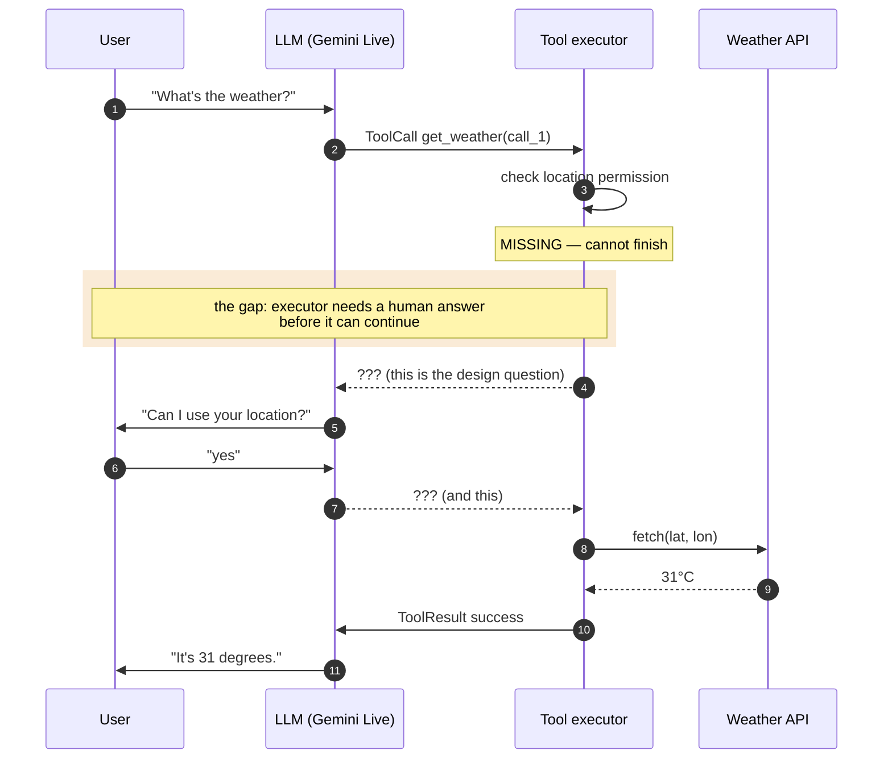

Six independent dimensions. Pick one per dimension → a design.

## Constraints fixed by the answers

| Constraint | Consequence |
|---|---|
| **Voice-only, no UI** | A3 and B4 are dead *as a user-facing channel*. They survive only for **machine-originated** external factors (webhook, background job, timer) where no human is prompted. |
| **Gemini first, OpenAI later, provider-neutral protocol** | A2 is demoted from *the protocol* to *an adapter optimization*. A1 becomes the portable baseline. The core must not know which one an adapter used. |
| **Permission is one instance of many external factors** | The design keys on an **external-factor taxonomy**, not a permission feature. See below. |

The remaining open question — *is a state machine even the right model?* — is expanded
in "Computation models" at the end of this document. Dimension C below is the
FSM-family slice of that larger space.

---

## Dimension A — the suspend seam

What happens to the vendor's open `call_id` while the executor waits.

### A1 — Interim-close, resume via new call

Suspension resolves `call_id` **now** with a non-success envelope (`needs_input`)
carrying ask-text + resume token. Model asks the user. The answer arrives as a *fresh*
tool call. The run outlives the call.

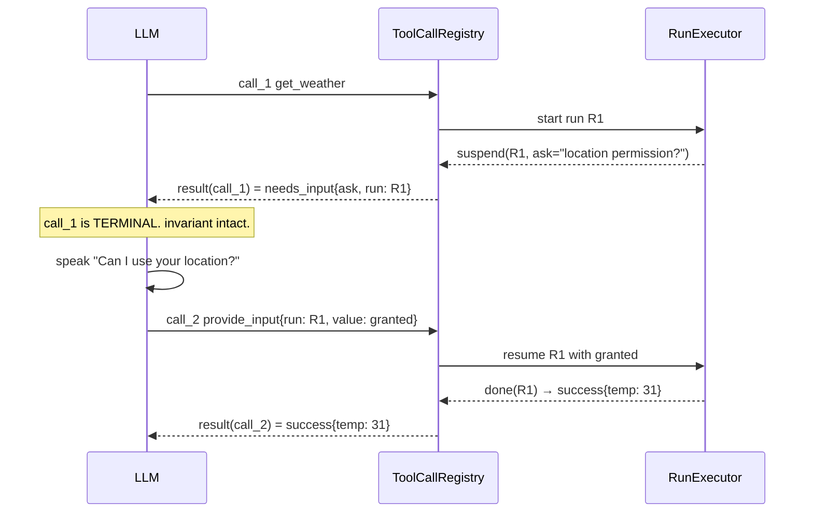

- **+** One-result invariant untouched. Vendor-agnostic. Model never blocked.
- **−** Run identity ≠ call identity → a new `ToolRun` concept must exist. The resume
  token travels through the LLM, which can mangle or drop it.

### A2 — Hold `call_id` open, vendor non-blocking path

Gemini Live supports `behavior: NON_BLOCKING` function declarations plus `scheduling`
(`INTERRUPT` / `WHEN_IDLE` / `SILENT`) on late function responses. `Tool.non_blocking`
and `PendingCall.schedule` already reserve exactly this. Send an interim response
(`{status: "asking"}`), the model keeps talking, send the real response later.

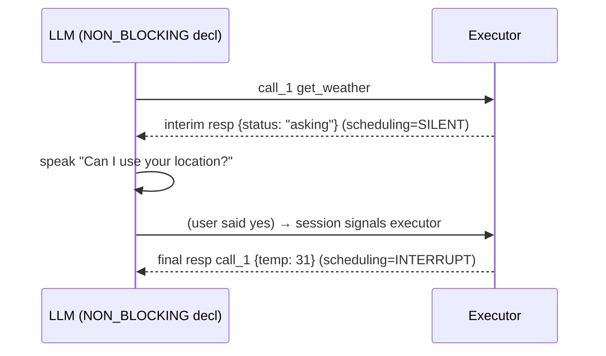

- **+** Vendor-native. Run == call, no new identity. `schedule` field finally earns
  its keep.
- **−** Gemini-shaped. OpenAI Realtime has no equivalent (you'd emulate by withholding
  `function_call_output` and driving `response.create` yourself). Adapter behaviour
  becomes asymmetric — interim/final semantics differ per vendor.

### A3 — Hold `call_id` open, ask out-of-band

The LLM is never involved in obtaining the input. The session emits an app event, the
client renders a permission dialog / file picker, the client resolves the run, the
executor finishes and sends a single `functionResponse`.

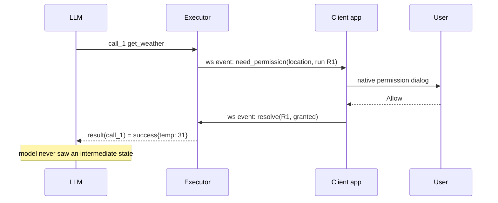

- **+** Fully deterministic; LLM sees no intermediate state at all. Simplest FSM.
  The only viable path for **file** input.
- **−** Requires a UI. Impossible in voice-only. The model sits silent while the user
  is prompted — awkward in a speech-to-speech session.

### A4 — Two declared tools, LLM sequences

Expose `get_weather` and `grant_location`. `get_weather` returns
`blocked{reason: "need permission"}`; the model asks; the model calls
`grant_location`; the model retries `get_weather`.

- **+** Zero framework machinery. Works against today's code unchanged.
- **−** Retry/sequencing is the LLM's job — precisely the nondeterminism the issue is
  trying to escape. Tool surface grows N×. No run state anywhere.

### A5 — Interim-close, resume via the *same* tool with extra args

Model re-calls `get_weather{location_permission: "granted"}`. No new tool, no run token.

- **+** Small surface, self-describing to the model.
- **−** Executor must re-derive progress from args → idempotency burden lands on the
  tool author. Args-as-state is leaky and doesn't scale past one missing input.

### A6 — Suspended run becomes a scoped sub-conversation

The suspend spawns a mini-agent whose only job is to obtain the value, then returns to
the parent run. Composes with the existing Router/handoff machinery.

- **+** Reuses multi-agent primitives already built.
- **−** Very heavy. Token ownership, handoff seams, and barge-in all get dragged in
  for a yes/no.

---

## Dimension B — who emits the transition event

| | Source | Determinism | Notes |
|---|---|---|---|
| **B1** | framework tool `provide_input(run_id, value)` | high | structured args; LLM only classifies intent |
| **B2** | same tool re-called with filled args | medium | pairs with A5 |
| **B3** | session classifies the next user transcript itself | high-ish | no tool call at all; `UserTranscript` already lands in `session.py:85` |
| **B4** | client / out-of-band channel (websocket, UI, file upload) | total | pairs with A3; the only path for file input |
| **B5** | all of the above normalized to one `ExternalInput(run_id, key, value)` | — | not a choice — the union; the executor sees one event type and sources are pluggable |

B3 is the literal reading of the requirement — *"only pass states of tool to LLM so
based on natural query it can give me a transition state"*. The LLM performs
**classification**, not orchestration. B1 achieves the same via the tool-call channel
rather than the transcript channel.

---

## Dimension C — how the tool's multi-step logic is expressed

### C1 — Coroutine / generator

Handler is a coroutine that `yield`s an `Ask(...)`; the executor suspends it and later
sends the value back in. FSM is implicit in the program counter.

- **+** Tool author writes linear code. Branching and loops come free. No state enum
  bookkeeping.
- **−** FSM is neither inspectable nor serializable. No process-restart survival.
  Debugging means reading coroutine frames. Satisfies the *behaviour* asked for while
  contradicting the *"model this as an FSM"* framing.

### C2 — Explicit state table

Tool declares `states`, `initial`, and `transition(state, event) → (next_state, action)`.
The executor is a pure interpreter.

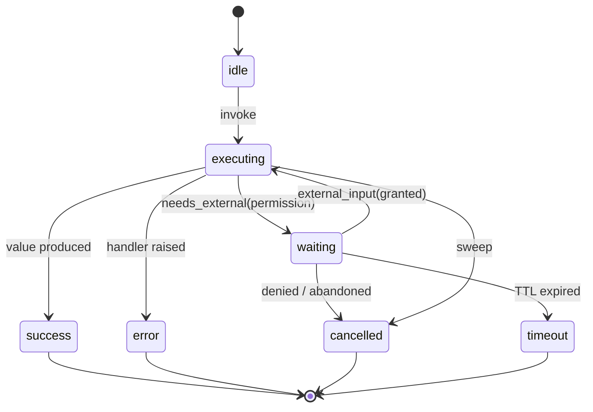

- **+** Exactly the FSM the issue asks for. Inspectable, testable, serializable,
  drawable. Illegal transitions are structurally impossible. Mirrors how `CallState`
  was already done in `pending.py:16`.
- **−** Verbose per tool. The author manually shreds logic into states; locals become
  explicit context entries.

### C3 — Linear step pipeline

Tool = ordered steps; each step is `Pure(fn)` or `Requires(input_key, prompt)`. The
executor walks index `0..N`.

- **+** Covers the dominant real case (confirm → execute) with minimal ceremony.
  Trivially serializable: state = step index + collected inputs.
- **−** No branching, no loops, no retry-in-place. Extending it turns it into C2 anyway.

### C4 — Continuation-passing

Handler returns `Done(result)` **or** `Suspend(ask, resume=callable)`. The executor
stores the callable and later invokes it with the value.

- **+** Between C1 and C2 in weight. Explicit suspend boundaries, ordinary functions,
  arbitrary branching.
- **−** The continuation is a closure → same non-serializable problem as C1. Nested
  suspends nest closures.

### C5 — Declarative preconditions (reframe)

Don't make the *tool* multi-step. The tool declares `requires: [location_permission]`.
The executor resolves preconditions **before** entering the handler, using a generic
per-precondition resolver (which may itself ask the user). The handler stays one-shot,
exactly as today.

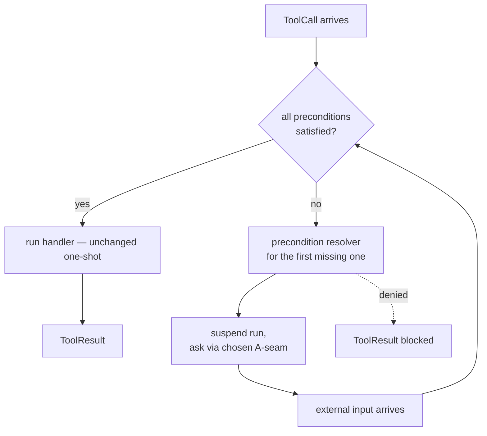

- **+** `src/snail/tools/executor.py` never changes. Permission/confirm/file logic is
  written once and shared by every tool. Genuinely deterministic — resolution is
  framework code, not tool code. Sits naturally alongside the existing
  "exposure ≠ authority" split.
- **−** Only fits *dependency-shaped* suspension. A tool that genuinely needs input at
  step 3 of 5 doesn't fit, and you'd end up running two mechanisms.

### C6 — External FSM spec (data, not code)

States and transitions live in YAML/JSON per tool; handlers are named side-effect
functions the spec references.

- **+** Fully data-driven, versionable, diagram-generable, editable by non-engineers.
- **−** Indirection tax; debugging crosses a spec↔code boundary. Overkill unless tools
  are authored outside the engineering team.

---

## Dimension D — where run state lives

| | Where | Durability | Forced by / conflicts with |
|---|---|---|---|
| **D1** | memory, on a `ToolRun` record | dies with process | works with anything |
| **D2** | coroutine frame / closure | dies with process | forced by C1, C4 |
| **D3** | `EventLog` replay (`tool_run_suspended` / `tool_run_resumed` events) | restart-safe | requires C2/C3/C6; free observability |
| **D4** | stateless — state encoded in the token the LLM round-trips | none server-side | LLM can corrupt/replay it; token bloat; needs signing if it carries authority |

---

## Dimension E — correlating a resume back to its run

- **E1 — explicit `run_id`** round-tripped through the LLM. Unambiguous, supports N
  concurrent runs. The LLM may drop or garble it.
- **E2 — implicit `(session, tool_name)`**. One live run per tool. No token. Breaks on
  two concurrent runs of the same tool.
- **E3 — a single pending-input slot per session** — "the thing we're waiting on".
  Matches voice reality (a user answers one question at a time) and is trivially
  deterministic. Breaks with parallel calls in one response group, which the registry
  explicitly supports via `by_response_group`.
- **E4 — `parent_call_id` chaining**. Yields a run graph in the log for free, but the
  seam still needs one of E1–E3 to do the actual matching.

---

## Dimension F — cancel / timeout / barge-in of a *waiting* run

A waiting run spans turn boundaries, so it **outlives** its `response_group_id`. The
existing sweeps (`call_registry.py:120-130`) are group- and connection-scoped, and
neither fits.

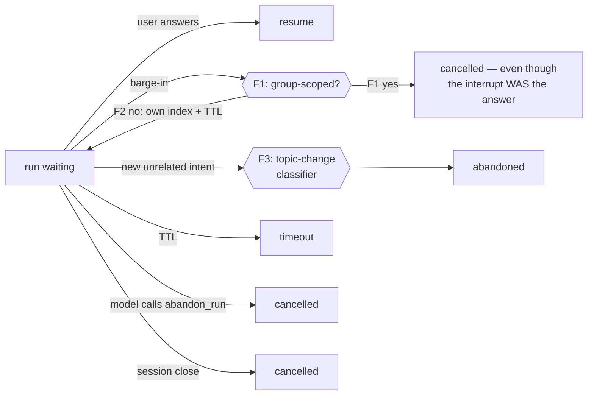

- **F1** — waiting runs stay group-scoped, so barge-in kills them. Safe, but a user
  who interrupts *in order to say yes* kills the thing they were answering.
- **F2** — separate run index with its own long TTL. Waiting runs survive barge-in and
  turn-end; only session close or explicit abandon kills them. Needs a third index
  alongside `by_group` / `by_conn`.
- **F3** — topic-change invalidation, policy-driven. Needs a classifier → nondeterminism
  returns.
- **F4** — model-driven abandon via a framework `abandon_run(run_id)` tool, or the model
  simply never resumes and the TTL reaps it.

Orthogonal and already locked by `docs/claude/04`: **side effects are not rolled back**.
A cancelled run that half-executed is the tool author's problem.

---

## The two-layer FSM question

Every A-seam except A2/A3 implies **two** state machines, not one. The existing
`CallState` tracks a `call_id`; a new run-level FSM tracks work that spans several
`call_id`s.

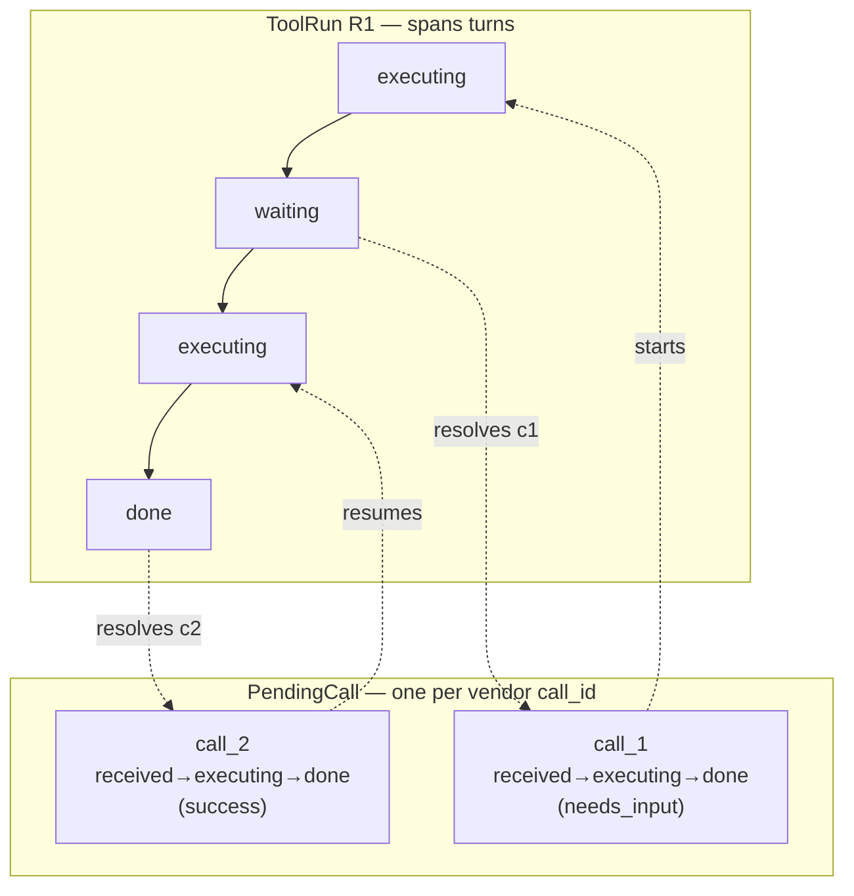

Under A2/A3 the run and the call are the same object, and `AWAITING_EXTERNAL` in the
existing `CallState` is all that's needed — no second FSM.

---

## Coherent combinations

| # | Combo | Character |
|---|---|---|
| **I** | A1 + B1 + C2 + D1 + E1 + F2 | The literal ask: explicit FSM, explicit run, LLM only classifies. Most machinery. |
| **II** | A1 + B1 + C1 + D2 + E1 + F2 | Same seam, ergonomic authoring. FSM behavioural, not structural. |
| **III** | A1 + B3 + C3 + D3 + E3 + F2 | Voice-native: pipeline tools, session classifies the yes/no, log-durable, one pending slot. Least LLM involvement. |
| **IV** | ~~A2~~ + B1 + C1/C4 + D2 + (E n/a) + F1 | **Ruled out as the protocol** by the neutrality constraint. Survives as a Gemini adapter fast path under A1's contract. |
| **V** | ~~A3 + B4~~ + C5 + D1 + E1 + F2 | **Ruled out for user-facing factors** — no UI. C5 itself survives and pairs with A1. |
| **VI** | A4 + B2 + (no C) | Do nothing new. LLM sequences. Zero code, maximum nondeterminism. |
| **VII** | A1 + B1 + C6 + D3 + E1 + F2 | Fully data-driven FSMs. Heaviest, most inspectable. |

Incoherent pairings worth naming so they aren't proposed later:

- **A3 + B1** — asking out-of-band but resuming through the LLM: two channels, no reason.
- **A2 + D3** — holding a socket-bound call open while claiming restart durability.
- **C1/C4 + D3** — closures don't serialize. *(Exception: deterministic replay — M8
  below — buys durability without serializing the closure. It is the one way to have
  both.)*

---

## What the choice actually turns on

1. ~~Voice-only, or is there a client UI?~~ → **answered: voice-only.** A3/B4 survive
   only for machine-originated factors.
2. ~~Gemini-only, or must OpenAI behave identically?~~ → **answered: neutral protocol
   required.** A1 is the baseline; A2 becomes an adapter capability.
3. **Is suspension always dependency-shaped** (permission or confirm *before* the work),
   **or genuinely mid-computation?** If always dependency-shaped, C5 is far less
   machinery than any per-tool FSM and `tools/executor.py` never changes. — *still open;
   the factor taxonomy below is the evidence needed to answer it.*
4. **Must a run survive process restart?** Only D3 + C2/C3/C6 — or M8 — gets that.
5. **Does the model need to be inspectable** (drawable, log-replayable) **or merely
   correct?** C2/C6/M3/M4 versus C1/C4.

---

# External-factor taxonomy

"Waiting on permission" is one row. The protocol keys on the **kind**, because the
kinds differ on who satisfies them, whether a spoken turn is required at all, and the
expected latency.

| Kind | Who satisfies | Needs the model to speak? | Latency | Example |
|---|---|---|---|---|
| **consent** | user, by voice | yes | seconds | location permission, "charge your card?" |
| **confirmation** | user, by voice | yes | seconds | "book the 6pm flight — confirm?" |
| **disambiguation** | user, by voice | yes | seconds | "which John — Smith or Doe?" |
| **datum** | user, by voice; often already in transcript | maybe | seconds | delivery date, address |
| **choice** | user, by voice | yes | seconds | pick one of N options |
| **artifact** | user, out-of-band upload | maybe (to prompt) | seconds–minutes | a file, a photo |
| **third-party callback** | external system | **no** | seconds–hours | payment webhook, booking confirmation |
| **background job** | own backend | **no** | seconds–minutes | long report generation |
| **temporal** | the clock | **no** | arbitrary | "retry after the market opens" |
| **peer agent** | another agent in the session | no | seconds | a specialist agent's answer |
| **resource** | scheduler | no | seconds | rate limit, quota, lock |

Two structural facts fall out:

1. **Not every wait involves the user or the LLM.** Rows 7–11 resolve on a backend
   channel. Any design that routes *all* suspension through the model is wrong for half
   the taxonomy. The resume input source must be pluggable (B5).
2. **The wait's expected duration ranges over five orders of magnitude.** One TTL policy
   cannot serve both a 2-second consent and a 4-hour webhook. The kind must carry its
   own budget and its own barge-in policy (F).

A third, subtler one: **rows 1–5 are the only ones where the LLM adds value** — it
converts free-form speech into a typed value. That is exactly the "LLM gives me a
transition, not an execution path" split the requirement asks for.

---

# Computation models

FSM is one model. Here is the actual space. These are alternatives to Dimension C, and
each implies different answers in D/E/F.

## M1 — Flat finite state machine

Dimension C2. States, transitions, one active state.

- **+** Smallest possible thing that is inspectable and serializable. Matches the
  existing `CallState`.
- **−** **One active state.** A tool waiting on *two* factors at once (consent AND a
  webhook) needs a combinatorial state per subset — the classic state explosion.

## M2 — Statechart (hierarchical FSM)

Harel statecharts / XState. Adds nested states, **orthogonal regions**, guards, and
**history states** to M1.

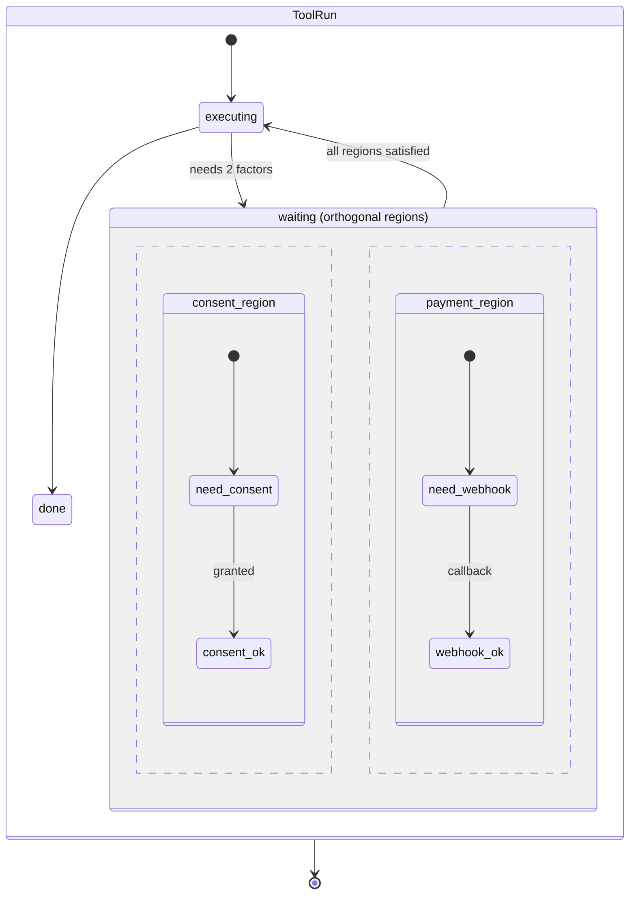

- **+** Orthogonal regions solve the concurrent-wait explosion directly. History states
  give correct resume-after-barge-in for free. Still fully declarative, still drawable,
  still serializable (state = the set of active leaf states).
- **−** Bigger concept surface for tool authors. Guard/transition-priority semantics
  are subtle. Realistically needs a library rather than a hand-rolled interpreter.

## M3 — Workflow graph (LangGraph / Airflow shape)

Nodes = steps, edges = control or data dependency. Suspension is a node that yields.
Cyclic if retries are allowed, DAG if not.

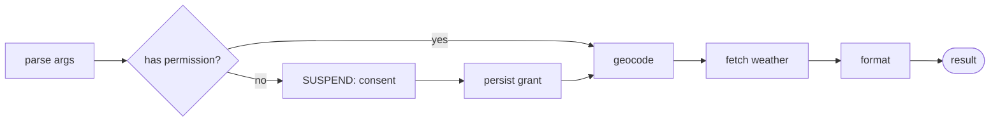

- **+** The mental model most people already have. Parallel branches are natural
  (fan-out/fan-in over several external factors). Node-level retry, caching, and
  timeouts are standard. Visualisation is basically free.
- **−** A graph *is* an FSM with the state implicit in the frontier — you gain notation,
  not power, unless you allow multiple simultaneously-active nodes. If you do, you have
  reinvented a Petri net (M4) with less rigour.

## M4 — Petri net

Places hold tokens; a transition fires only when **all** its input places are marked.
Concurrency and joins are first-class rather than bolted on.

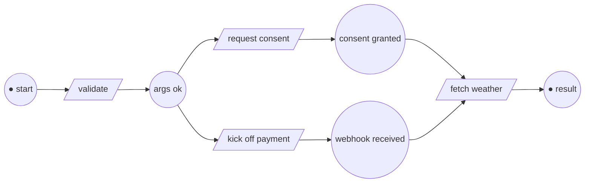

- **+** Exactly models "wait until N independent factors have arrived, in any order".
  AND-joins, OR-joins, and resource limits are native. Formally analysable — deadlock,
  reachability, and liveness are decidable, so you can *prove* no run can hang.
- **−** Unfamiliar to most engineers. Tooling is academic-grade. Heavy for
  "confirm then execute". Best justified if concurrent multi-factor waits are common.

## M5 — Dataflow / promise graph

Every external factor is a promise. The tool is a composition over promises; the
runtime resolves them; suspension is implicit in an unresolved promise.

- **+** No explicit states at all. Concurrent waits are just `gather`. Extremely small
  runtime — arguably you already have it in `Promise` (`registry/pending.py:51`).
- **−** No inspectable structure: "what is this run waiting on?" is answerable only by
  walking live objects. Not serializable. Hardest model to debug from a log.

## M6 — Blackboard / dependency resolution

A shared fact store per session. A run declares the facts it requires; resolvers fill
gaps; the run is re-attempted whenever the blackboard gains a fact.

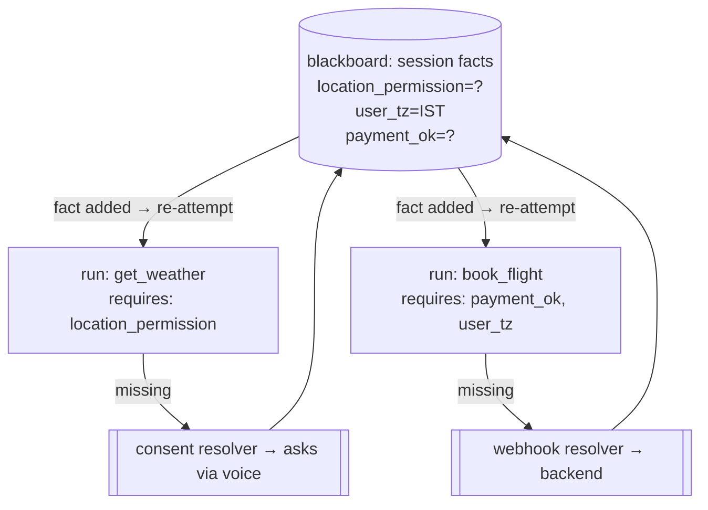

- **+** Generalises C5. Facts are **shared across runs and across turns** — permission
  granted for one tool is instantly available to every other. Resolvers are written once
  per factor *kind*, not once per tool. Handlers stay one-shot; `tools/executor.py`
  never changes. Naturally provider-neutral: the blackboard has no idea an LLM exists.
- **−** Re-attempt semantics demand idempotent handlers. Poor fit for genuinely
  sequential work ("step 3 needs input that step 2 computed"). Fact staleness and scoping
  (per-turn? per-session? per-user?) become real questions.

## M7 — Algebraic effects / free monad

The tool is a program in a small DSL of effects — `Ask(kind, prompt)`, `Fetch(url)`,
`Confirm(text)` — and an interpreter decides how each effect is discharged.

- **+** The cleanest possible statement of "separate execution flow from the LLM": the
  tool declares *what it needs*, the interpreter decides *how it is obtained* (voice,
  webhook, cached fact, or a test stub). Swapping interpreters gives free
  testability — the same tool runs headless in unit tests with zero mocking.
- **−** In Python this is a coroutine yielding effect objects, which lands back at C1 —
  the elegance is conceptual, the implementation is still a suspended generator with the
  same serialization problem. Unfamiliar idiom for most contributors.

## M8 — Durable execution / deterministic replay

Temporal's model. The handler is written as linear code. Every external interaction is
recorded to an event history. On resume (or process restart) the handler is **re-run
from the top**, with recorded results replayed instantly, until it reaches the point
where new input is needed.

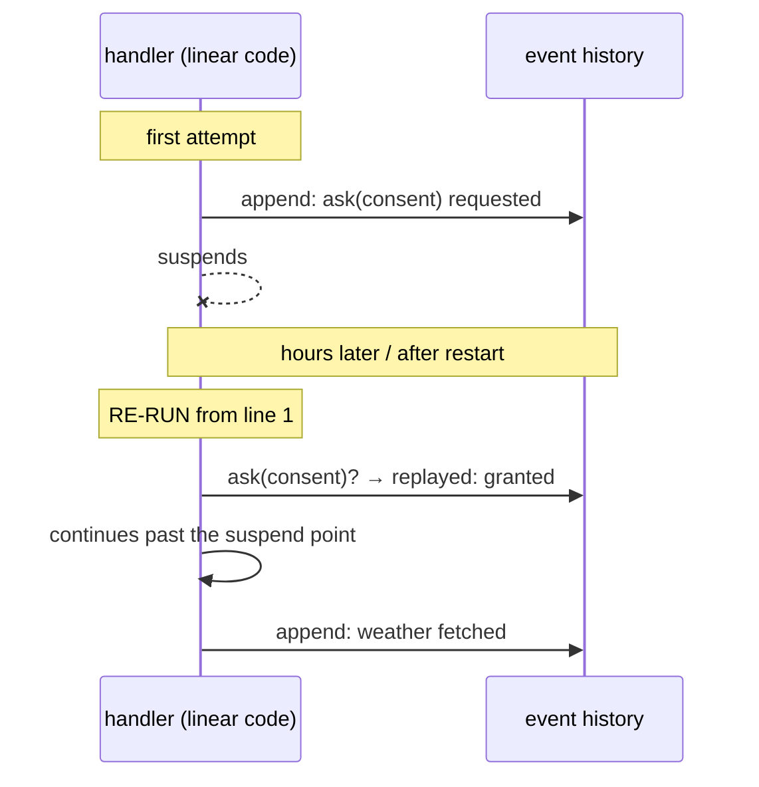

- **+** C1's authoring ergonomics *with* D3's durability — the one combination
  previously listed as incoherent. Arbitrary control flow. Full audit trail by
  construction, and you already have `EventLog` to hold it.
- **−** Handlers must be **deterministic** on replay: no unguarded clock, randomness, or
  I/O outside the recorded effects. That is a real constraint on tool authors and a real
  class of bugs. The heaviest runtime in this list.

## M9 — Actor with mailbox

Each run is an actor; external factors arrive as messages; the actor's behaviour is a
state machine over its mailbox.

- **+** Supervision, lifecycle, and per-run isolation come free. Message ordering is
  explicit. Maps well onto one-asyncio-loop-per-session (docs 06).
- **−** Orthogonal to the modelling question — you still need M1/M2 *inside* the actor.
  This is a concurrency structure, not a modelling alternative.

## M10 — CSP / channel-blocking process

The run blocks on a channel receive; external input is a channel send.

- **+** Trivial to reason about, trivial to implement on asyncio.
- **−** Same non-inspectability as M5. State lives in a blocked coroutine.

## M11 — Rule / production system

Facts plus `when-condition-then-action` rules; a rule engine fires whatever is eligible.

- **+** Maximum flexibility; new external factors are new rules, no tool changes.
- **−** Control flow becomes emergent and hard to predict — the opposite of the
  determinism the requirement is chasing.

## Comparison

| | Concurrent waits | Branch/loop | Serializable | Inspectable | Author cost | Formal analysis |
|---|---|---|---|---|---|---|
| M1 flat FSM | ✗ (explodes) | ✓ | ✓ | ✓ | med | ✓ |
| M2 statechart | ✓ | ✓ | ✓ | ✓ | high | ✓ |
| M3 workflow graph | ~ | ✓ | ✓ | ✓✓ | med | ~ |
| M4 Petri net | ✓✓ | ✓ | ✓ | ✓ | high | ✓✓ |
| M5 promise graph | ✓ | ✓ | ✗ | ✗ | low | ✗ |
| M6 blackboard | ✓✓ | ✗ | ✓ | ✓ | **low** | ~ |
| M7 effects | ✓ | ✓ | ✗ | ~ | low | ✗ |
| M8 durable replay | ✓ | ✓ | ✓ (as history) | ✓✓ | med + determinism rules | ✗ |
| M9 actor | ✓ | — | — | ~ | med | ✗ |
| M10 CSP | ✓ | ✓ | ✗ | ✗ | low | ✗ |
| M11 rules | ✓ | emergent | ✓ | ✗ | low | ✗ |

The honest summary: **M1/M3 are notational variants of each other**; **M2 and M4 are the
two answers to concurrent multi-factor waits**; **M6 is the cheapest thing that covers
the taxonomy** if suspension is dependency-shaped; **M8 is the only way to get linear
authoring plus durability**; M5/M7/M10 are the same idea (a suspended coroutine) wearing
different clothes; M9/M11 are not really alternatives.

---

# Provider-independent protocol

The neutrality requirement is a statement about **layering**, not about picking a seam.
Three protocol shapes.

## P1 — Envelope-carried (everything rides the tool channel)

Suspension is a `ToolResult` status. The ask rides in the result content as a speak
directive. Resume arrives as a framework tool call. The adapter only serializes; it
makes no decisions.

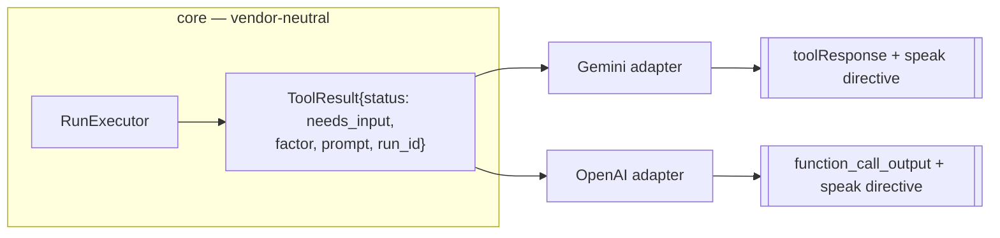

- **+** Simplest. One channel. Nothing new in the transport. `ToolStatus` already has
  the shape and an unused `DEFERRED` slot to model it on.
- **−** Overloads the result envelope with control semantics. The status enum, which
  today means "how did this call end", starts also meaning "what does the run need".
  Cannot exploit Gemini's non-blocking path — every adapter is forced to A1.

## P2 — Control-plane events (suspension is not a result)

The executor emits a neutral `RunSuspended(run_id, factor, prompt, budget)` on a control
channel. The **session** decides how to surface it — speak directive, backend event, or
cached-fact lookup — and emits `ExternalInput(run_id, factor, value)` back when it has
the answer.

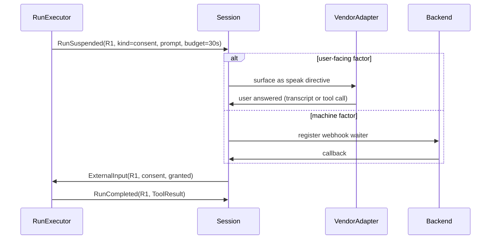

- **+** Clean separation: the executor states a **need**, never a mechanism. The
  taxonomy's machine-originated rows fit the same protocol as the voice rows. The result
  envelope keeps its single meaning. Testable with no vendor at all.
- **−** A second channel to build and reason about. Ordering between the control plane
  and the tool channel needs defining.

## P3 — Capability-negotiated

P2 plus a declared per-adapter capability set. The core emits intent; each adapter picks
the best mechanism it has; a portable fallback always exists.

| Capability | Gemini Live | OpenAI Realtime | Fallback if absent |
|---|---|---|---|
| `interim_result` (respond now, respond again later) | ✓ `NON_BLOCKING` + `scheduling` | ✗ | close the call with `needs_input`, resume via new call (A1) |
| `result_scheduling` (`interrupt`/`when_idle`/`silent`) | ✓ | ✗ | always interrupt |
| `per_response_instructions` | ✗ | ✓ `response.create` | directive rides in content (already the documented baseline, docs 03) |
| `withhold_response` (leave a call unanswered, still speak) | ~ | ✓ item-based | A1 |

- **+** The one shape that satisfies "Gemini now, OpenAI later" *without* either
  degrading Gemini to the lowest common denominator or leaking vendor concepts into the
  core. Same pattern already used for schema dialects — except here it is a runtime
  capability rather than a compile-time common denominator.
- **−** Two code paths per capability means two paths to test. A latent risk of
  behavioural drift between vendors that only shows up in production.

## What the protocol must nail regardless of shape

1. **Run identity ≠ call identity.** Under any portable seam, a run spans multiple
   `call_id`s. The one-result invariant applies to calls; runs need their own terminal
   rule.
2. **Factor kind is a first-class field.** It drives budget, barge-in policy, and which
   resolver handles it.
3. **The LLM's only job is typed extraction** — free speech → a value of the factor's
   declared type. Never sequencing, never retry, never orchestration.
4. **The resume path must not require the LLM.** Half the taxonomy resolves on a backend
   channel.
5. **Every run terminates.** A per-kind budget plus a reaper, mirroring the existing
   per-call deadline rule.
6. **Suspension must be visible in the log.** Otherwise a stuck run is undebuggable in a
   voice session where nothing is on screen.
