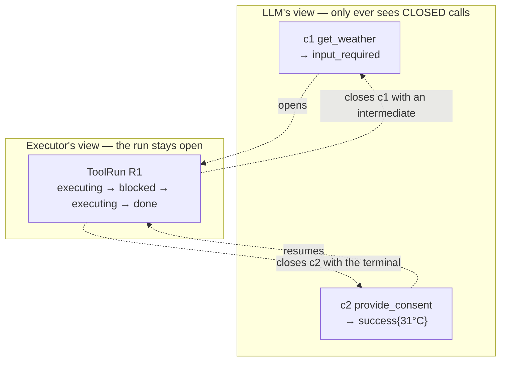
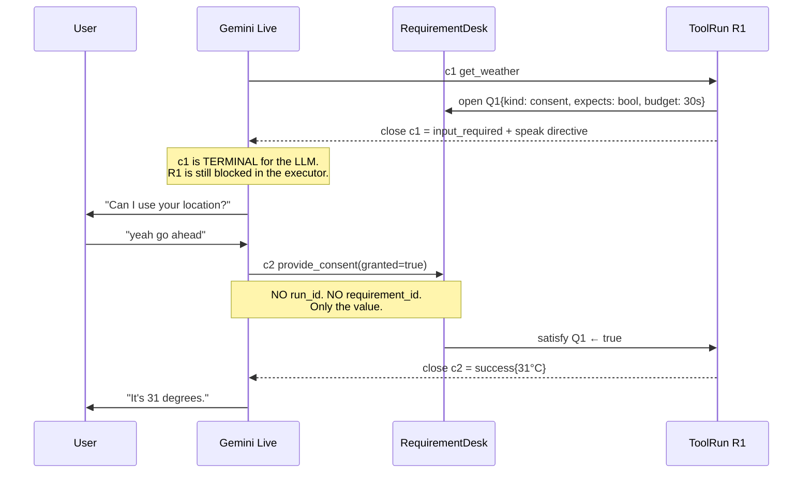
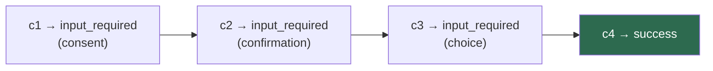
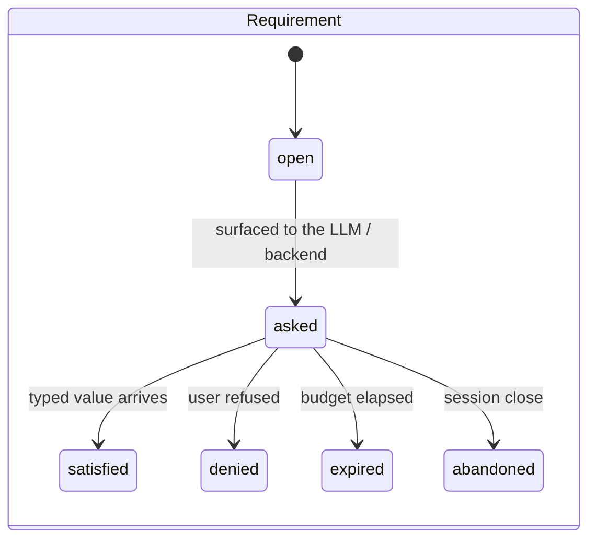
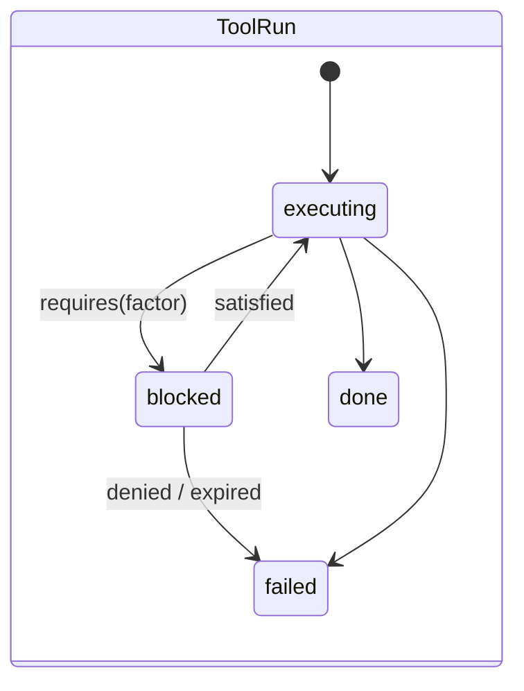
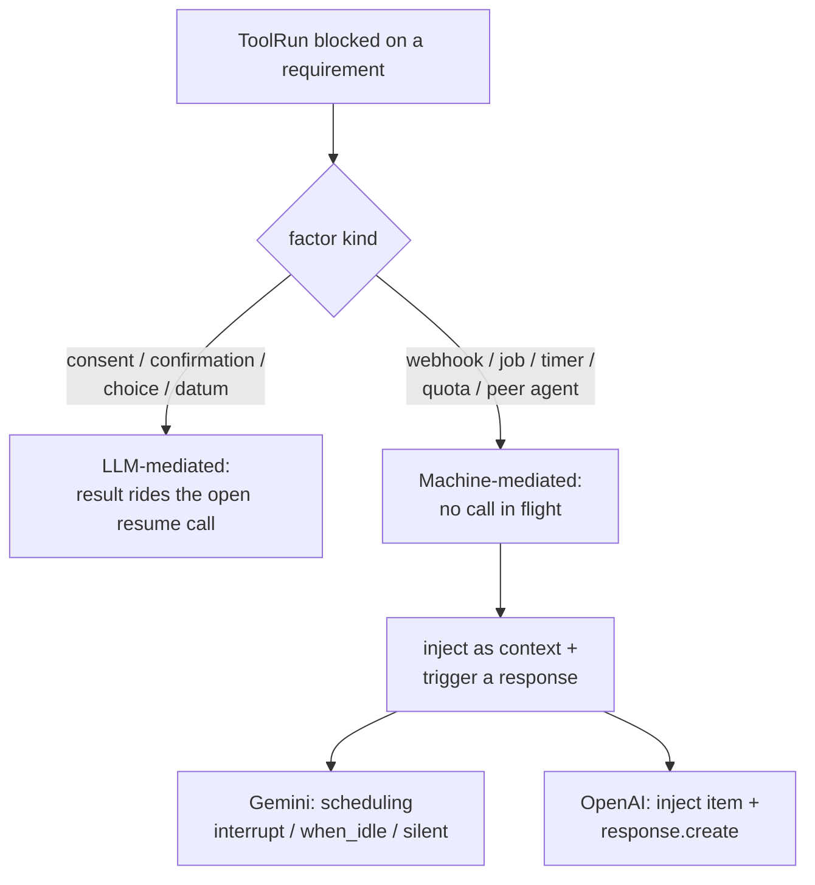

# Multi-step tool execution — the narrowed design

Third document in the set:

1. [`tool-call.md`](./tool-call.md) — the problem statement
2. [`tool-call-approaches.md`](./tool-call-approaches.md) — the full solution space
3. **this** — the one design, narrowed from that space

Not a spec. This is the design under review; the spec follows once it is agreed.

## Where it lands in the solution space

| Dimension (from doc 2) | Choice |
|---|---|
| A — suspend seam | **A1** interim-close, resume via a new call |
| B — transition-event source | **B1 + B4** framework resume tool for user factors, backend channel for machine factors, normalized to one event (B5) |
| C / M — computation model | **run + requirement FSMs framework-side** (M1 applied to framework objects), linear coroutine-style tool bodies |
| D — run state | **D1** in memory, on the run record; observability via EventLog (not D3 replay) |
| E — correlation | **executor-side desk, E3-flavoured.** Explicitly *not* E1 — no id round-trips through the LLM |
| F — waiting lifecycle | **F2** own index, own per-kind budget, survives barge-in |
| P — protocol shape | **P3** capability-negotiated; A1 is the portable floor, Gemini's non-blocking path is an adapter fast path |

---

## Constraints that forced it

| Constraint | Forced consequence |
|---|---|
| Gemini returns a `tool_call_id` and expects it echoed in `ToolResponse` | every call must close exactly once — the existing one-result invariant (`docs/claude/04`) survives untouched |
| An intermediate response closes that loop | **accept it.** Don't fight the vendor. Make *call*-terminality and *run*-terminality two different things |
| Zero state-management dependency on the LLM | **no `run_id` or `requirement_id` may appear in any LLM-visible payload.** Rules out E1 |
| Voice only, no UI | user-facing factors must resolve through speech; there is no dialog to render |
| Gemini now, OpenAI later | the core states a *need*; adapters choose the mechanism |
| Permission was only one example | resolution logic keys on **factor kind**, written once per kind — never once per tool |

---

## 1. Two loops, different terminality

The single idea the whole design rests on. The vendor's loop and the executor's loop are
not the same loop, and only the vendor's has to close.



`ToolRun` stands in a 1—N relationship with `PendingCall`. The LLM holds no state; the
executor holds all of it.

`INPUT_REQUIRED` is **terminal for the call and intermediate for the run**. That double
reading is the requirement, stated exactly.

## 2. The resume call carries the next result

The load-bearing mechanic. Every intermediate closes its call with `INPUT_REQUIRED`. The
**resume call becomes the carrier** for whatever the run produces next — either the real
result, or the next `INPUT_REQUIRED`.

N requirements → N+1 calls. Every call closes exactly once. The invariant is never bent,
only re-scoped.



Chaining works without a special case: if the run blocks again, `c2` closes with another
`INPUT_REQUIRED` and `c3` carries the next step.



## 3. `RequirementDesk` — where the LLM's state would have been

Session-scoped table of open requirements. This object exists precisely so that nothing
needs to be remembered by the model.

**Correlation rule — deterministic, executor-side:**

1. the resume tool's kind → filter open requirements of that kind
2. exactly one match → bind
3. several matches → the most-recently-asked (voice means one question at a time — the
   model asked the last one)
4. no match → `skipped`, harmless

**Every LLM failure mode degrades safely:**

| LLM does | Outcome |
|---|---|
| resumes correctly | run continues |
| never resumes | requirement budget expires, run is reaped |
| resumes twice | first wins; the second gets `skipped` |
| resumes with nothing open | `skipped` |
| garbles the value | schema validation → `invalid_args` (retriable); requirement stays open |
| resumes the wrong kind | no match of that kind → `skipped`; original requirement untouched |

There is no path where a wrong model guess corrupts executor state. That property is the
entire justification for the design.

## 4. Static framework resume tools

Gemini Live declares functions at **setup**. Minting a per-requirement tool mid-session
would mean a session update or reconnect — unacceptable. So the resume surface is static
and declared once: **one tool per factor kind**, always exposed, `is_framework=True`,
intercepted by the Router (exposure ≠ authority, `docs/claude/03`).

```
provide_consent(granted: bool)
provide_confirmation(confirmed: bool)
provide_choice(option: string)
provide_value(value: string)        ← coerced against the open requirement's schema
```

The model's entire job is **free speech → one typed value**. Never sequencing, never
retry, never orchestration. This is the only thing an LLM is actually better at than the
executor, and it is stateless by construction.

## 5. The FSM sits on the Requirement and the Run — not on the Tool

The inversion. There is no per-tool state chart to author. Two small framework-side
machines cover every tool:





Tool bodies stay **linear**: they await a requirement and carry on. All determinism is
framework code, so it is written and tested once rather than re-derived per tool.

Restart durability is deliberately **not** a goal — a voice session dies with its
websocket, so serializable run state buys nothing. Inspectability is bought instead from
the `EventLog` (`requirement_opened`, `requirement_satisfied`, `run_blocked`, …), which
gives a replayable narrative without constraining how the run is written.

## 6. Machine-originated factors — the second delivery path

Webhooks, background jobs, timers and quota waits resume with **no open call to carry the
result**. Same protocol, different delivery.



Path 2 is what `PendingCall.schedule` and `Tool.non_blocking` were reserved for and never
used. The core emits a neutral intent; the adapter picks the mechanism.

## 7. Lifecycle policy

- **Requirements get their own index**, separate from `by_response_group` and
  `by_connection`. A wait spans turns, so neither existing index fits.
- **Barge-in does not cancel blocked runs.** In a voice session the interruption is
  frequently *the answer*. Barge-in still cancels actively-`executing` work as it does now.
- **Budget is per factor kind.** A 2-second consent and a 4-hour webhook cannot share a
  TTL.
- **The desk is session-scoped, not connection-scoped.** A handoff mid-wait therefore
  doesn't strand the requirement — the answer binds regardless of which agent relays it.
- **Side effects are still never rolled back** (locked in `docs/claude/04`). A run
  abandoned after partial execution remains the tool author's problem.

## 8. Surface area of the change

| Change | Where |
|---|---|
| new `ToolStatus.INPUT_REQUIRED` | `src/snail/tools/result.py` |
| new `ToolRun`, `Requirement`, `RequirementDesk` | new module |
| suspend/resume branch in dispatch | `src/snail/session/session.py:141` `_run_tool` |
| framework resume tools + Router interception | `src/snail/tools/registry.py`, `src/snail/router/` |
| three new event types | `src/snail/context/` EventLog |
| adapter capability for machine-path delivery | `src/snail/vendor/` |
| `execute()` — **unchanged** | `src/snail/tools/executor.py` stays pure |

---

## Open judgment calls

Two places where a different reading gives materially different work.

**J1 — §5, no per-tool FSM.** The state machine lives on the requirement and the run, not
on each tool. If the goal is for every tool to declare its own explicit, drawable state
table, §5 gets swapped for C2/C6 from doc 2 and tool authoring cost rises accordingly.

**J2 — §4, kind-specific resume tools** rather than one generic `provide_input(value)`.
Costs four declarations at setup; buys the model unambiguous semantics per factor kind.

## Deliberately deferred

- Restart/replay durability (M8) — no value while sessions are websocket-bound.
- Concurrent multi-factor waits within one run (would pull in M2 orthogonal regions or
  M4). The design blocks on one requirement at a time; revisit only if a real tool needs
  two at once.
- Topic-change invalidation of a pending requirement (F3) — needs a classifier, and
  classifiers reintroduce the nondeterminism this design removes.
